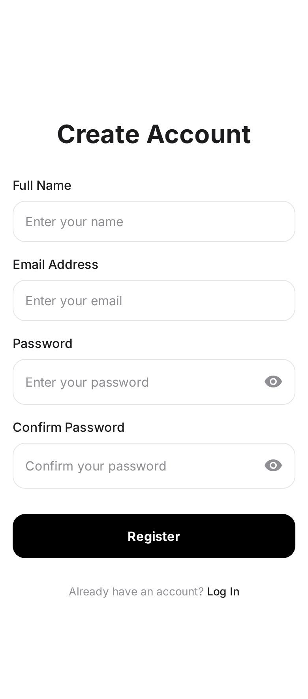

# 📝 Todo App

A modern, feature-rich task management application built with Flutter, featuring a clean and intuitive user interface. This app helps you organize your daily tasks efficiently with reminders, categories, and a beautiful user experience.

## ✨ Features

- 🔐 **User Authentication** - Secure login and registration
- 📋 **Task Management** - Create, edit, and delete tasks with ease
- ⏰ **Smart Reminders** - Set custom reminders for your tasks
- 🎨 **Beautiful UI** - Modern and intuitive design
- 📱 **Responsive Design** - Works seamlessly across different screen sizes
- 💾 **Local Storage** - Tasks saved securely using Hive database
- 🔔 **Task Details** - Comprehensive task view with all relevant information
- 🌓 **Splash Screen** - Smooth app startup experience

## 🖼️ Screenshots

<div align="center">
  
  
  
  
</div>

<div align="center">
  
  
  
  
</div>

<div align="center">
  
</div>

## 🎨 Design Credits

The beautiful UI design for this application was created using **[Stitch AI](https://stitch.withgoogle.com/home)** - an AI-powered design tool that helps create stunning mobile app interfaces.

## 🏗️ Architecture

This project is built using the **BLoC (Business Logic Component)** pattern, ensuring:

- ✅ **Event-driven architecture** - Clean separation of events and states
- ✅ **Clear separation of concerns** - Business logic separated from UI
- ✅ **Reactive state management** - Powered by streams
- ✅ **Testability** - Easy to test with bloc_test
- ✅ **Predictable state transitions** - Reliable app behavior
- ✅ **Scalability** - Perfect for complex apps and enterprise teams

## 🛠️ Tech Stack

- **Framework**: Flutter SDK (>=3.24.0)
- **Language**: Dart (>=3.3.0)
- **State Management**: flutter_bloc ^8.1.6
- **Local Database**: Hive ^2.2.3
- **Secure Storage**: flutter_secure_storage ^9.2.2
- **HTTP Client**: Dio ^5.5.0
- **Connectivity**: connectivity_plus ^6.0.5
- **Responsive UI**: Sizer ^2.0.15

## 📦 Key Dependencies

```yaml
dependencies:
  flutter_bloc: ^8.1.6 # State management
  hive: ^2.2.3 # Local database
  flutter_secure_storage: ^9.2.2 # Secure data storage
  dio: ^5.5.0 # HTTP client
  connectivity_plus: ^6.0.5 # Network connectivity
  equatable: ^2.0.5 # Value equality
  sizer: ^2.0.15 # Responsive design
```

## 🚀 Getting Started

### Prerequisites

- Flutter SDK (>=3.24.0)
- Dart SDK (>=3.3.0)
- Android Studio / VS Code
- Android SDK / Xcode (for iOS)

### Installation

1. **Clone the repository**

   ```bash
   git clone https://github.com/chirag640/todo-app.git
   cd todo_app
   ```

2. **Install dependencies**

   ```bash
   flutter pub get
   ```

3. **Set up environment variables** (optional)

   ```bash
   cp .env.example .env
   # Edit .env with your configuration
   ```

4. **Run the app**
   ```bash
   flutter run
   ```

### Build for Production

**Android:**

```bash
flutter build apk --release
# or for app bundle
flutter build appbundle --release
```

**iOS:**

```bash
flutter build ios --release
```

## 📱 Platform Support

- ✅ Android
- ✅ iOS
- ✅ Web
- ✅ Linux
- ✅ macOS
- ✅ Windows

## 🧪 Testing

```bash
# Run all tests
flutter test

# Run tests with coverage
flutter test --coverage
```

## 📁 Project Structure

```
lib/
├── app/              # App initialization and routing
├── core/             # Core utilities, database, config
│   ├── config/       # Environment and app configuration
│   ├── database/     # Hive database setup
│   └── ...
├── features/         # Feature modules
│   └── home/         # Home/Task management feature
│       └── presentation/  # UI and BLoC
└── main.dart         # Application entry point
```

## 🤝 Contributing

Contributions, issues, and feature requests are welcome! Feel free to check the [issues page](https://github.com/chirag640/todo-app/issues).

## 📝 License

This project is licensed under the MIT License - see the [LICENSE](LICENSE) file for details.

## 👨‍💻 Author

**Chirag**

- GitHub: [@chirag640](https://github.com/chirag640)

## 🙏 Acknowledgments

- **[Stitch AI](https://stitch.withgoogle.com/home)** for the amazing UI design
- **[flutter_blueprint](https://pub.dev/packages/flutter_blueprint)** for project scaffolding
- Flutter and Dart teams for the amazing framework
- BLoC library for excellent state management

---
